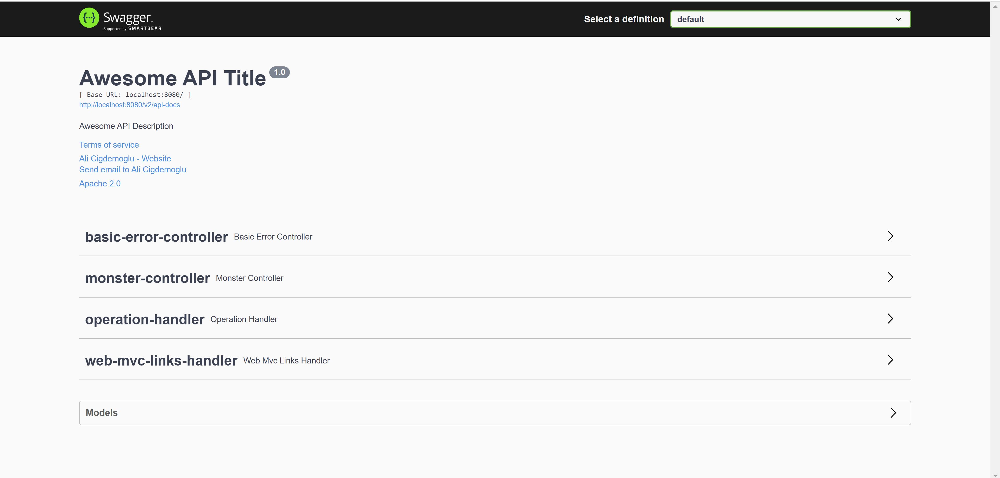
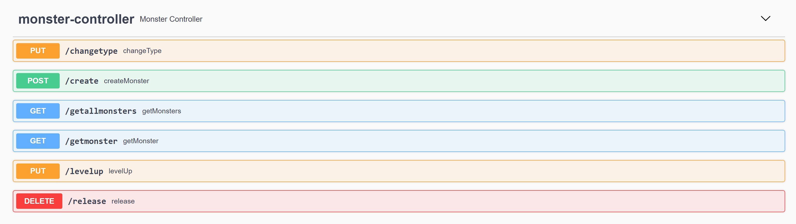
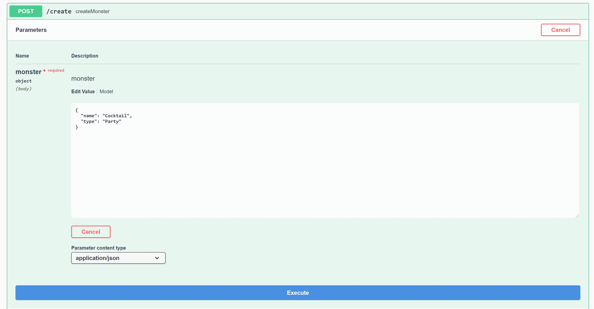
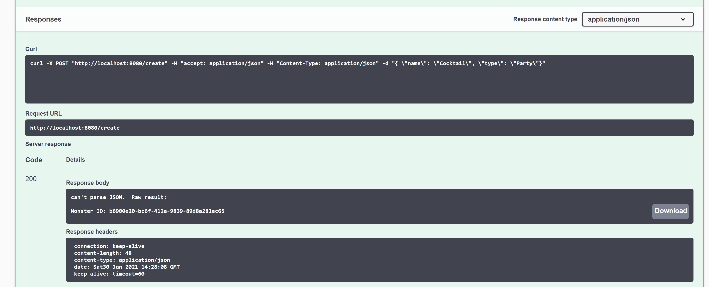
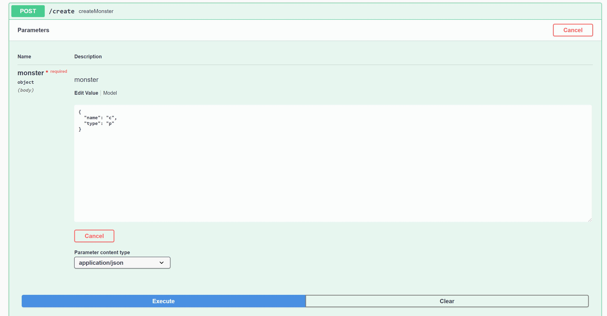
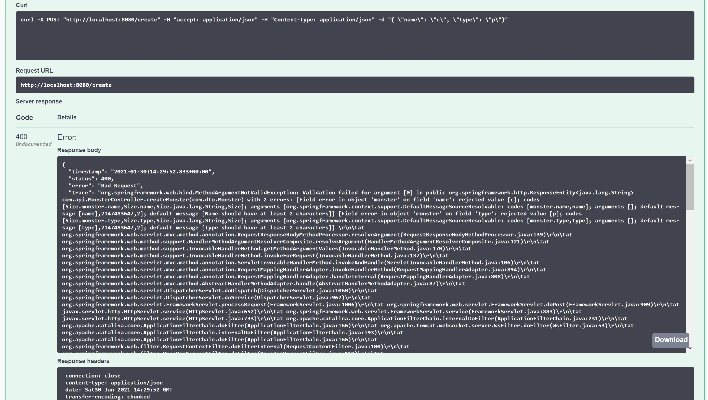
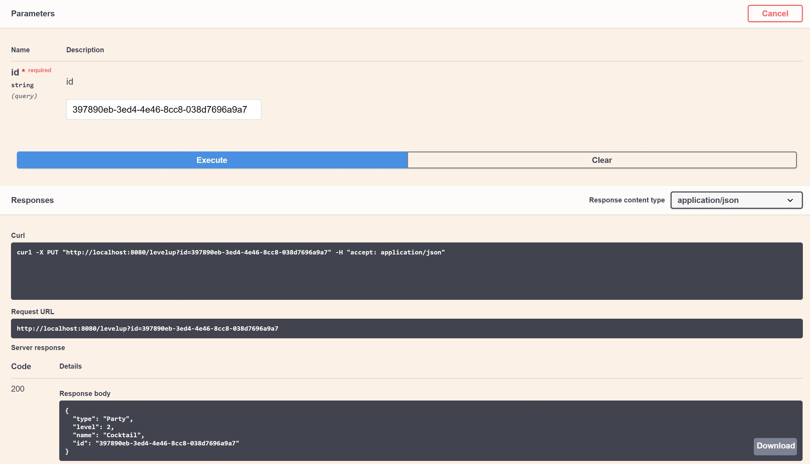

# Welcome to my Intern Project: Monster Trainer!

## What is this project about???
This is an API client that allows you to create monsters, level them up, change their types, and release them into the wild world net! You can will be able to try it on your own once you clone the repo, execute the installation steps, and use the beautiful UI of Swagger UI.

## Installation
Make sure you have Maven installed as per assignment description.
```
git clone git@github.com:Alicigdemoglu/internspringboot.git
cd internspringboot
mvn clean install
mvn spring-boot:run
```
Once you execute these steps successfully, you go to http://localhost:8080/swagger-ui/
If all goes well you should see a screen like following


## API Methods
Swagger UI displays all exposed APIs

### Swagger-UI Testing
We can go ahead an create an experimental monster named "Cocktail" with type "Party" thanks to the local MongoDB storing our data


Because we have input validation in place, if you send an incorrect JSON or less than 2 characters per field, you would see the following 4xx error response


In this example, using the unique id "b6900e20-bc6f-412a-9839-89d8a281ec65", we can level up our monster, and see the new data in the response


## UML
The structure of our entire API client code can be seen in this UML diagram


## Unit Testing
To execute JUNIT tests with a mocked DB thanks to Mockito:
```
cd internspringboot
mvn clean test
```
Expected result
```
...
[INFO]
[INFO] Results:
[INFO]
[INFO] Tests run: 5, Failures: 0, Errors: 0, Skipped: 0
[INFO]
[INFO] ------------------------------------------------------------------------
[INFO] BUILD SUCCESS
[INFO] ------------------------------------------------------------------------
[INFO] Total time:  25.918 s
[INFO] Finished at: 2021-01-30T09:24:01-05:00
[INFO] ------------------------------------------------------------------------
```

## Thanks
I used many online resources to accomplish this task, and put everything together spending hours on the project.
I especially want to thank to https://www.baeldung.com/ which has been extremely helpful in accomplishing this task.
I am also grateful to the Sennovate Family for giving me this opportunity, considering my application, and helping me develop my skills even at the application stage.

Hope you enjoyed my project, cheers!
Ali
